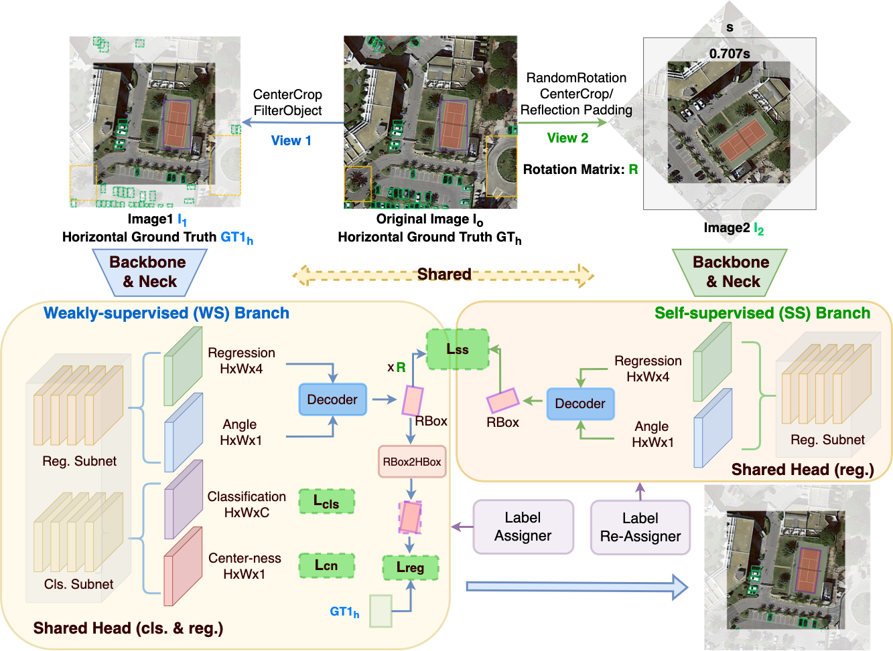

# H2RBox
> [H2RBox: Horizontal Box Annotation is All You Need for Oriented Object Detection](https://arxiv.org/abs/2210.06742)

<!-- [ALGORITHM] -->
## Abstract

<div align=center>

</div>

Oriented object detection emerges in many applications from aerial images to autonomous driving, while many existing detection benchmarks are annotated with horizontal bounding box only which is also less costive than fine-grained rotated box, leading to a gap between the readily available training corpus and the rising demand for oriented object detection.  This paper proposes a simple yet effective oriented object detection approach called H2RBox merely using horizontal box annotation for weakly-supervised training, which closes the above gap and shows competitive performance even against those trained with rotated boxes.  The cores of our method are weakly- and self-supervised learning, which predicts the angle of the object by learning the consistency of two different views. To our best knowledge, H2RBox is the first horizontal box annotation-based oriented object detector. Compared to an alternative i.e. horizontal box-supervised instance segmentation with our post adaption to oriented object detection, our approach is not susceptible to the prediction quality of mask and can perform more robustly in complex scenes containing a large number of dense objects and outliers. Experimental results show that H2RBox has significant performance and speed advantages over horizontal box-supervised instance segmentation methods, as well as lower memory requirements. While compared to rotated box-supervised oriented object detectors, our method shows very close performance and speed, and even surpasses them in some cases.

## Results and models

DOTA1.0

|         Backbone         |  mAP  | Angle | lr schd | MS  | Batch Size |                                                      Configs                                                      |                                     Download                                     |
|:------------------------:|:-----:|:-----:|:-------:|:---:|:----------:|:-----------------------------------------------------------------------------------------------------------------:|:--------------------------------------------------------------------------------:|
| ResNet50 (1024,1024,200) | 67.62 | le135 |   1x    |  -  |     2      |                 [h2rbox_obb_r50_adamw_fpn_1x_dota](./configs/h2rbox_obb_r50_adamw_fpn_1x_dota.py)                 | [model](), [Baidu Drive (pm0i)](https://pan.baidu.com/s/1nAgTTFhcAYWgeynjnZE8NQ) |


**Notes:**

- `MS` means multiple scale image split.
- Inf time was tested on a single RTX3090.
- [PyTorch Implementation for H2RBox](https://github.com/yangxue0827/h2rbox-mmrotate)

## Get Started

Please refer to the official guide of [JDet](https://github.com/Jittor/JDet).

## Citation
```
@article{yang2022h2rbox,
  title={H2RBox: Horizonal Box Annotation is All You Need for Oriented Object Detection},
  author={Yang, Xue and Zhang, Gefan and Li, Wentong and Wang, Xuehui and Zhou, Yue and Yan, Junchi},
  journal={arXiv preprint arXiv:2210.06742},
  year={2022}
}

```
